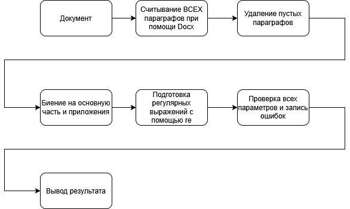

# Валидатор документов
  
Валидатор проверяет .docx документы на соответствие стандарту ТПУ

## Принцип работы

В реализации используются docx-python и re

> Каждая проверка реализована отдельным методом в классе

## Проверяемые параметры

|Параметр                                             |Значения                      |Релиз                     |
|:----------------------------------------------------|:-----------------------------|:------------------------:|
|Цель в преамбуле                                     |Наличие                       |***Есть***                |
|Проверка начала распорядительной части с 'приказываю'|Наличие и формат              |***Есть***                |
|Поручение довести до сведения                        |Наличие                       |***Есть***                |
|Контроль за исполнением                              |Наличие                       |***Есть***                |
|Приложение                                           |Корректность номера или литеры|***Есть***                |
|Размер шрифта в таблице                              |Не менее 8                    |***Есть***                |
|Размер шрифта в теле                                 |12                            |***Есть***                |
|Размер шрифта в шапке                                |10                            |***Есть***                |
|Размер шрифта подписи                                |10                            |***Есть***                |
|Название шрифта в теле                               |Arial                         |***Есть***                |
|Название шрифта в таблицах                           |Arial                         |***Есть***                |
|Проверка отделов в поручениях                        |Наличие                       |<ins>**Отсутствует**</ins>|
|Проверка отмены приказа                              |Наличие, номер и дата         |<ins>**Отсутствует**</ins>|
|Проверка отступов                                    |1.25                          |<ins>**Отсутствует**</ins>|
|Проверка ориентации                                  |Книжная                       |<ins>**Отсутствует**</ins>|
|Проверка обязательных пустых строк                   |Наличие                       |<ins>**Отсутствует**</ins>|
|Проверка нумерации страниц                           |Наличие                       |<ins>**Отсутствует**</ins>|
|Проверка места для штрих кода                        |Наличие                       |<ins>**Отсутствует**</ins>|

## Вывод в консоль

В выводе есть 3 типа сообщений:
1. Ошибки
2. Предупреждения
3. Информация

> На данный момент инфо нигде не применено, а предупреждения работают только в таблицах
